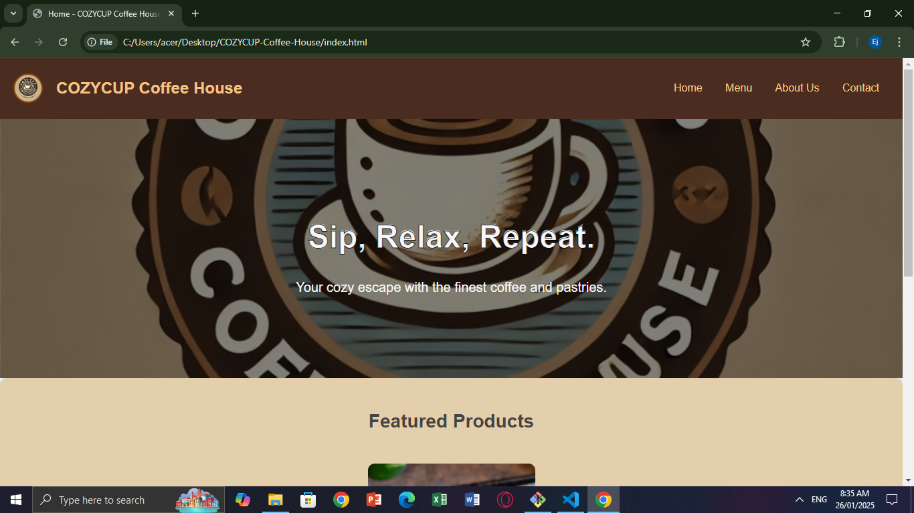
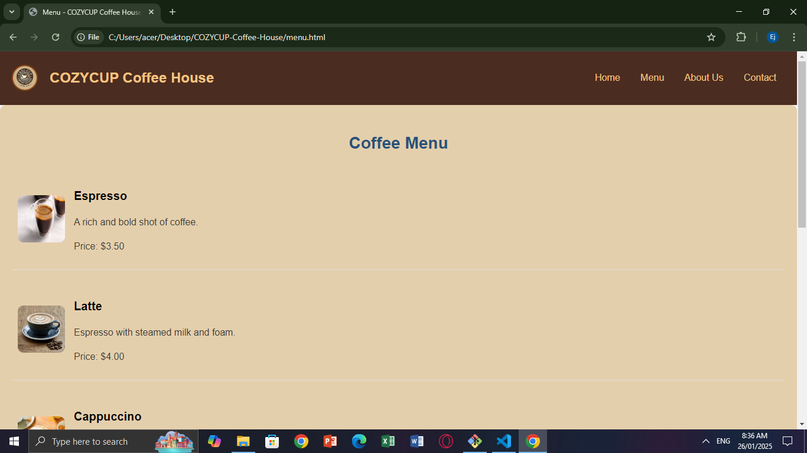
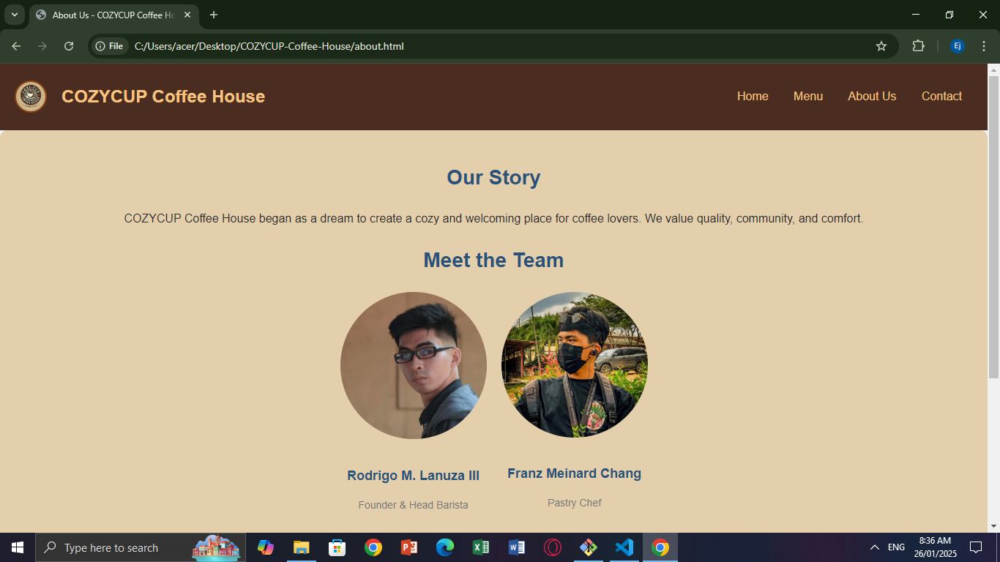
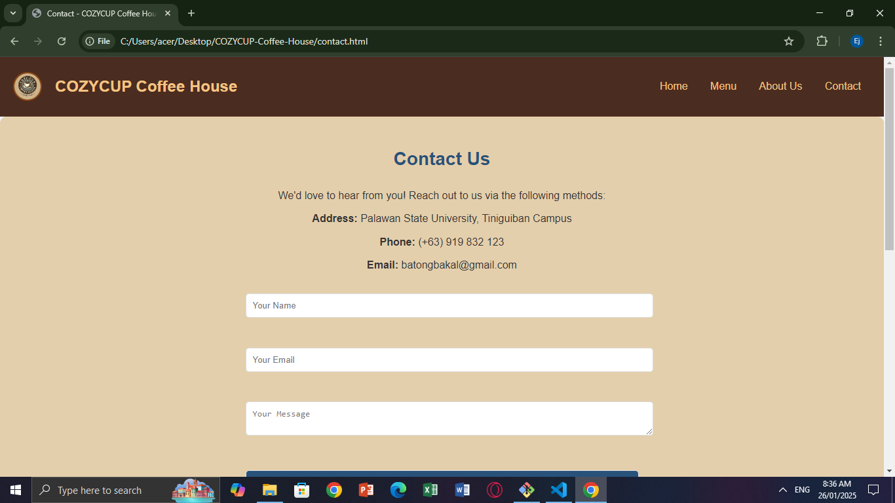
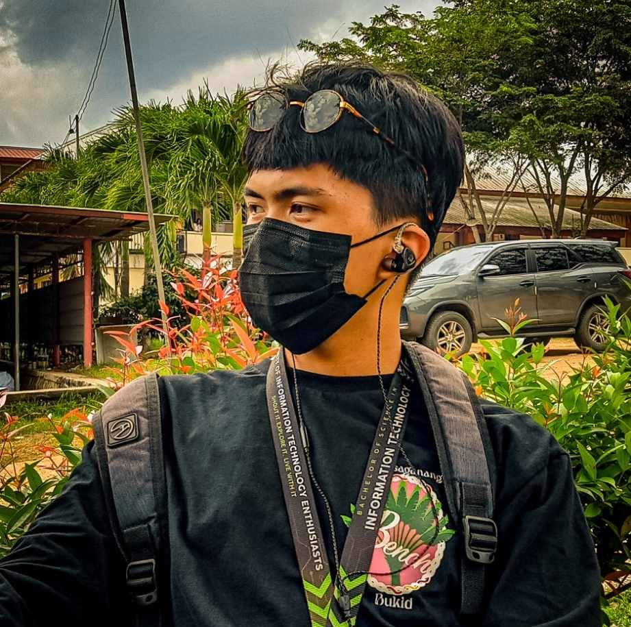

# Cozy Cup Cafe

## Project Description

Cozy Cup Cafe is a professional yet inviting website designed to represent a fictional coffee house. The site aims to provide users with an engaging experience by showcasing the menu, story, location, and contact options for the cafe. It uses a modern design aesthetic to ensure a comfortable and user-friendly interface.

---

## Features

- **Home Page:** Welcomes visitors with a hero section, catchy tagline, and featured products.
- **Menu Page:** Displays coffee and pastry options with descriptions and images.
- **About Us Page:** Shares the story, mission, and team details of the cafe.
- **Contact Page:** Includes an embedded map, contact form, and cafe information.
- **Newsletter Subscription:** Allows users to sign up for updates.
- **Social Media Integration:** Links to the cafe’s Facebook and GitHub profiles.

---

## Screen Captures

### **Home Page**
  
A warm and inviting hero section with a featured coffee product and a tagline.

### **Menu Page**
  
An attractive menu displaying coffee and pastry options with clear descriptions.

### **About Us Page**
  
A page that tells the story of the cafe and introduces the team.

### **Contact Page**
  
A simple contact form with an embedded map for easy navigation.

---

## About the Authors

### **Rodrigo M. Lanuza III**

**Name:** Rodrigo M. Lanuza III  

**Email:** [ejlanuza0123@gmail.com](mailto:ejlanuza0123@gmail.com)  

---

### **Franz Meinard N. Chang**
  

**Name:** Franz Meinard N. Chang  

**Email:** [franzmeinardchang10@gmail.com](mailto:franzmeinardchang10@gmail.com)  

